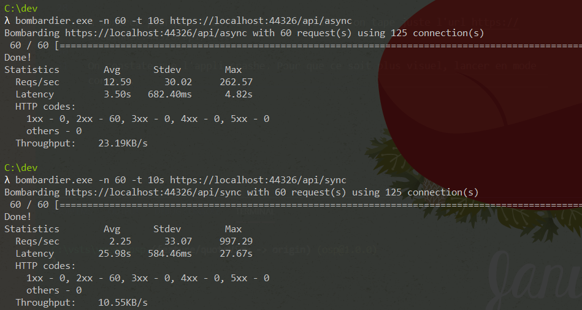

# Demo async await

Le but de cette démo est de démontrer la différence entre un comportement async non bloquant et un comportement sync bloquant sur une api ASP.NET Core.

## Tools

Pour faire le test de charge on va utiliser [bombardier](https://github.com/codesenberg/bombardier/releases).

## Tests

### Test en synchrone

On va d'abord taper l'api synchrone en exécutant :
```bash
λ bombardier.exe -n 60 -t 10s https://localhost:44326/api/sync
```

On lance 60 requetes, avec un timeout a 10s pour ne pas se faire jeter instantément.

## Test en Asynchrone

On tape l'api asynchrone comme ça :
```sh
λ bombardier.exe -n 60 -t 10s https://localhost:44326/api/async
```


On peut constater la différence entre le synchrone et l'async :


## Cas du async void

A montrer pourquoi l'async void est a bannir on tape juste l'url https://localhost:44326/api/test

On constate que l'appli crashe. Pour que ce soit plus visuel, lancer en mode console.